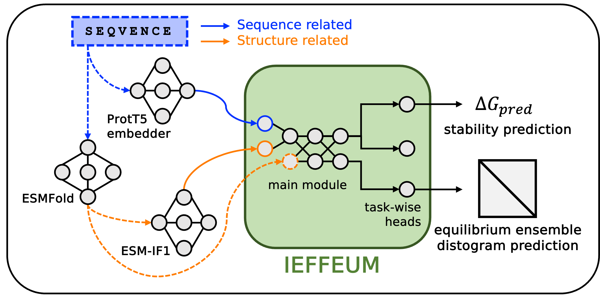

# IEFFEUM
IEFFEUM (***I***n silico ***E***valuation of Un***f***olding ***F***ree ***E***nergy with ***U***nfolded states ***M***odeling, 이쁨)

Please read the [manuscript](https://www.biorxiv.org/content/10.1101/2025.02.10.637420v1) before you use IEFFEUM.

We thank those who support open science. Without them, developing IEFFEUM was impossible.

## Table of Contents

- [Citation](#citation)
- [Before You Start](#before-you-start)
- [Installation](#installation)
    - Prerequisites
    - Installation Steps
- [Preparing Input Data](#preparing-input-data)
    - Input FASTA File
    - PDB Files (Optional)
    - Running `prepare_IEFFEUM.py`
- [Running IEFFEUM](#running-ieffeum)
- [Output CSV File](#output-csv-file)
- [(very important) Known Limitations](#known-limitations)

## Citation
If you use the code, please cite:
```
@article{
    doi:10.1101/2025.02.10.637420,
    author = {Heechan Lee and Hahnbeom Park},
    title = {Protein folding stability estimation with an explicit consideration of unfolded states},
    journal = {bioRxiv},
    year = {2025},
    doi = {10.1101/2025.02.10.637420},
    URL = {https://www.biorxiv.org/content/10.1101/2025.02.10.637420v1},
}
```
## Before You Start

IEFFEUM may produce slightly different predicted Δ*G* values when run on different GPUs. For instance, we observed a Δ*G* of 0.20 for MyUb with an A6000, and 0.19 with an A5000.

## Installation

IEFFEUM requires [ProtT5](https://github.com/agemagician/ProtTrans) and [ESM](https://github.com/facebookresearch/esm) (specifically, ESM-IF1).  While ESMFold is highly recommended for optimal performance, it's optional. You can provide pre-computed structures from any source.

**Prerequisites:**

1.  **NVIDIA GPU:**  Ensure your system has a compatible NVIDIA GPU and the drivers are correctly installed. Verify with:

    ```bash
    nvidia-smi
    ```

2.  **Conda:**  We strongly recommend using [miniconda](https://docs.anaconda.com/miniconda/install/).

**Installation Steps:**

Due to the archival of the ESM repository, installation requires a few specific steps.  These commands have been tested, but they differ slightly from those used in the training process.

```
conda create --name IEFFEUM python=3.9
conda activate IEFFEUM
conda install conda-forge::cudatoolkit=11.7
conda install nvidia/label/cuda-11.7.1::cuda
```
```
pip install omegaconf pytorch_lightning==2.1 biopython ml_collections einops py3Dmol modelcif dm-tree torch==2.0.1 torchvision==0.15.2 torchaudio==2.0.2
pip install git+https://github.com/NVIDIA/dllogger.git
pip install git+https://github.com/sokrypton/openfold.git
pip install git+https://github.com/facebookresearch/esm.git
pip install pyg_lib torch_scatter torch_sparse torch_cluster torch_spline_conv -f https://data.pyg.org/whl/torch-2.0.1+cu117.html
pip install torch_geometric biotite transformers sentencepiece numpy==1.26.1 pandas
git clone https://github.com/HParklab/IEFFEUM.git
cd IEFFEUM
pip install -e .
```

## Preparing Input Data
To run IEFFEUM (in batch), you need:
1. **Input FASTA File** (`.fasta`):  A FASTA file containing the amino acid sequences of the proteins you want to analyze.  This is **required**.
    ```
    # example: MyUb.fasta
    >MyUb_WT
    GTKKYDLSKWKYAELRDTINTSCDIELLAACREEFHRRLKVYH
    >MyUb_R1117A
    GTKKYDLSKWKYAELRDTINTSCDIELLAACREEFHRALKVYH
    ```
    **Important**: IEFFEUM processes sequences in batches for the efficiency, padding them to the length of the longest sequence in each batch. For optimal GPU memory usage, group proteins with similar sequence lengths into the same FASTA file. Different padding length affects IEFFEUM's prediction.

2. **Structure Files (Optional)**:  You have two options for providing structural information (target folded state):
    - **Option A**: **Provide PDB Files (recommended for longer proteins)**:  Place your `.pdb` files in a directory (e.g., `/PATH/TO/PDBs`).  The filenames should match the sequence identifiers in your FASTA file (e.g., `MyUb_WT.pdb`).
    ```
    # example: /PATH/TO/PDBs
    /PATH/
    └── TO/
        └── PDBs/
            ├── MyUb_WT.pdb 
            └── MyUb_R1117A.pdb
    ```

    - **Option B**: **Use ESMFold (easier)**: If you don't provide PDB files, `prepare_IEFFEUM.py` will automatically run ESMFold to predict the structures.

**Running** `prepare_IEFFEUM.py`:

This script generates the necessary files for IEFFEUM.

- **With Pre-computed PDB Files**:
    ```
    ./scripts/prepare_IEFFEUM.py --fasta <FASTA file> --pdb </PATH/TO/PDBs>
    # Example:
    # ./scripts/prepare_IEFFEUM.py --fasta examples/MyUb.fasta --pdb examples/MyUb_PDBs
    ```
    This will create a directory `/PATH/TO/PDBs/pt/` containing the `.pt` files.

- **Using ESMFold for Structure Prediction**:
    ```
    ./scripts/prepare_IEFFEUM.py --fasta <FASTA file>
    # Example:
    # ./scripts/prepare_IEFFEUM.py --fasta examples/MyUb.fasta
    ```

After running `prepare_IEFFEUM.py`, you should have:

1. `<FASTA_DIR>/<TARGET>.list`. A file containing the paths to the generated .pt files, where `<FASTA_DIR>` is the directory containing your input FASTA file.
2. One of the following:
    - `/PATH/TO/PDBs/pt/` directory containing `.pt` files (if you provided PDBs).
    - `/PATH/TO/FASTA/TARGET-esmfold/` directory containing `.pdb` and `TARGET-esmfold/pt/` with `.pt` files (if you used ESMFold).

        **Important Note on ESMFold Results:** It is highly recommended to the users to visually inspect the ESMFold-predicted structures.  [Poorly predicted structures can negatively impact IEFFEUM's accuracy](https://www.biorxiv.org/content/10.1101/2025.02.10.637420v1). Consider using pre-computed, high-quality structures (consider using [AF3](https://alphafoldserver.com/)).

## Running IEFFEUM

Once the input data is prepared, you can run IEFFEUM to calculate the Δ*G*. Note that IEFFEUM will use GPU whenever visible.

```
./scripts/run_IEFFEUM.py \
    -i <LIST file> \
    -m <path for model params (default: /PATH/TO/IEFFEUM/weights/params.pth)> \
    -o <path for result CSV file (default: ./TARGET.csv)> \
    -b <batch size (default: 1)>
    --per-resi <outputs per residue contribution (default: False)>

# Example:
# ./scripts/run_IEFFEUM.py -i examples/MyUb.list -o ../MyUb.csv -b 100 --per-resi
```

## Output CSV file

```
name,dG(kcal/mol)
MyUb_WT,0.20
MyUb_R1117A,-0.05
```

## Known Limitations

It's important to be aware that IEFFEUM's accuracy can be significantly reduced (typically biased towards unstable) when working with:
- Membrane proteins
- Monomeric structure of obligatory oligomers
- Proteins with inaccurate or low-quality folded state structures (i.e., poor-quality PDB input)

These limitations stem from that IEFFEUM was trained with soluble proteins in a PBS buffer environment.
